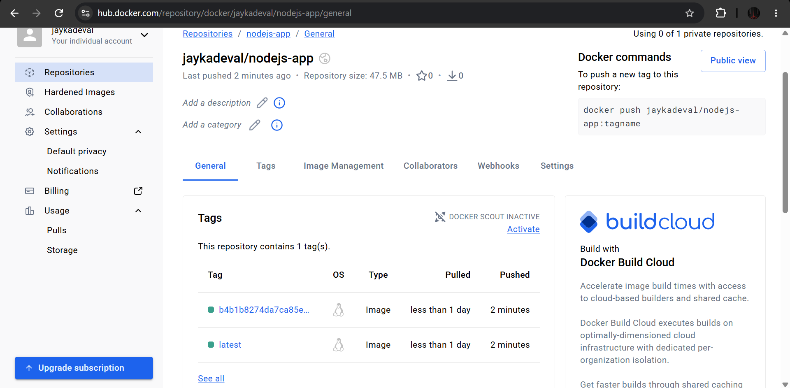
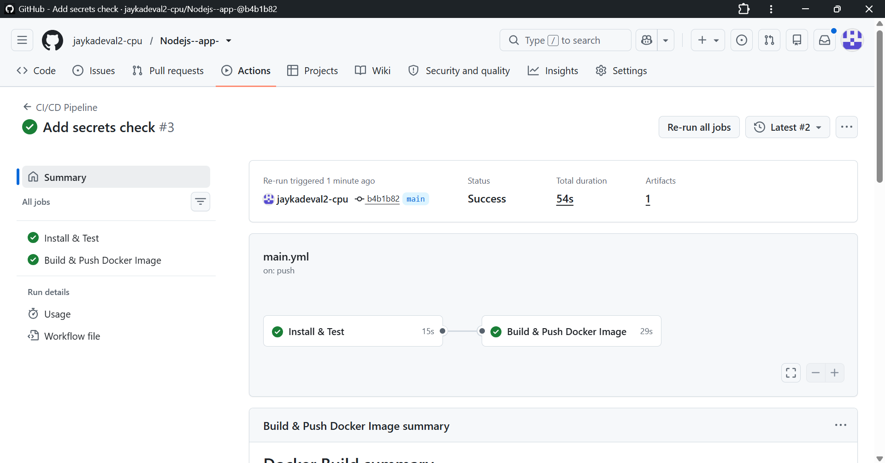

# nodejs-demo-app: CI/CD with GitHub Actions + Docker Hub

A small Express app with an automated pipeline: **test → build → push**.

## How it works
Triggered on every push to `main` (`.github/workflows/main.yml`):
1. **Install & Test**: checkout, Node 20, `npm ci`, `npm test`
2. **Build & Push Docker Image** (runs only if tests pass): logs in to Docker Hub with GitHub secrets, builds the image, pushes `latest` and the commit-SHA tag.

## Tools
GitHub, GitHub Actions, Node.js (Express, Jest), Docker, Docker Hub

## Setup
1. Create a Docker Hub access token (Read & Write).
2. Add repository secrets `DOCKERHUB_USERNAME` and `DOCKERHUB_TOKEN`.
3. Push to `main`.

## Run locally
```bash
npm install
npm test
npm start
docker build -t nodejs-app .
docker run -p 3000:3000 nodejs-app
```

## Screenshots



## Issue I fixed
The Docker login first failed with "Username and password required" because the secrets had the wrong names. Using the exact names the workflow expects fixed it.